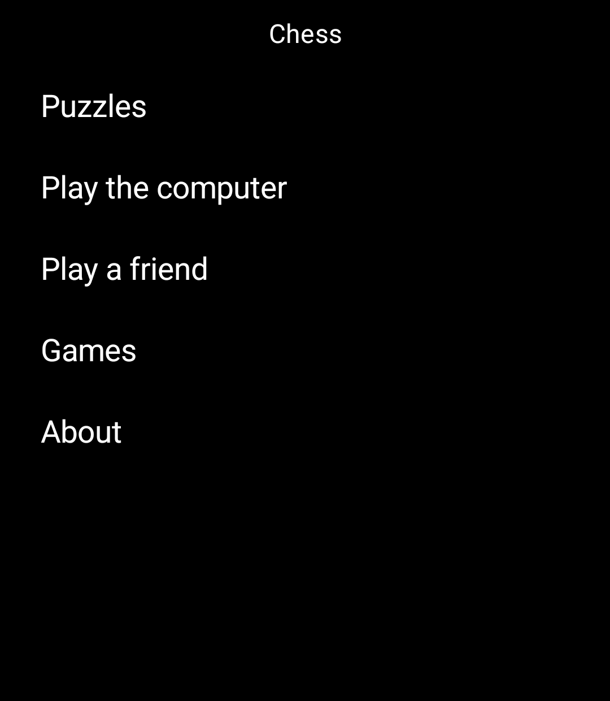
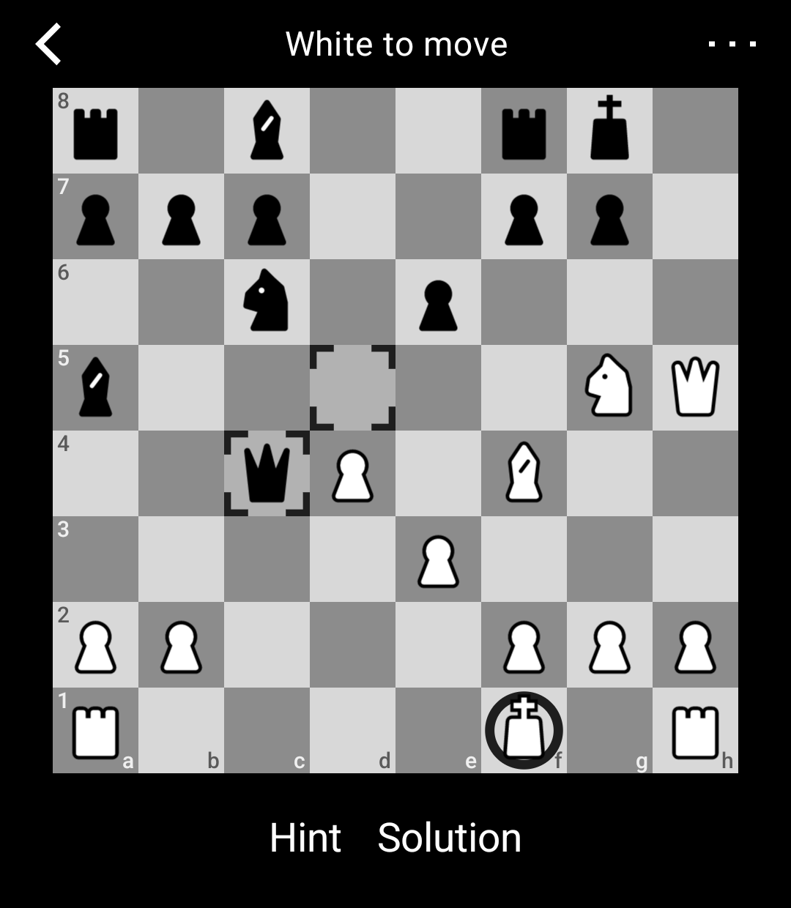
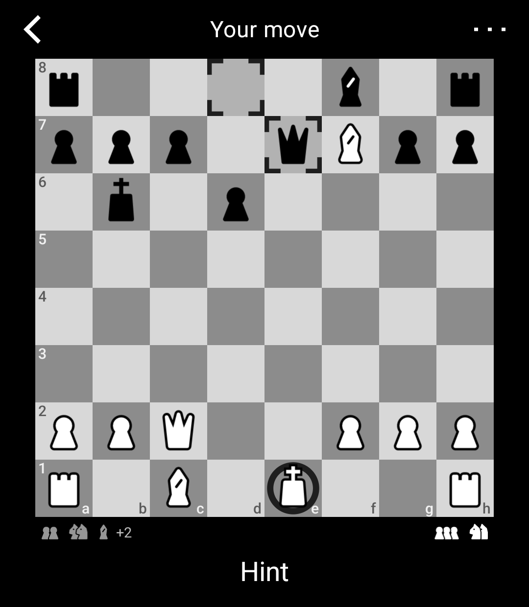

# Chess

Chess Puzzles, games against the computer, and Games with a friend, for the Light Phone III.

Solve real positions from the Lichess puzzle database, 46,971 of them, chosen for your level.
Your Player Rating moves with every rated Puzzle, and the ones you missed wait for another try.
Or play the computer at one of eight Levels, on the phone itself, or a friend by correspondence, a
few days per Move. No account and nothing tracked; only Games with a friend use the network.

> **Status: 0.4.1, Puzzles (v1), playing the computer (v2) and playing a friend by correspondence
> (v3) are done; not yet listed by Light.** A Light Phone III Tool built on
> [Light's SDK](https://github.com/lightphone/light-sdk).

Questions or bugs: https://github.com/yarosz/light-chess/issues

<p>
  
  
  
</p>

_Home, a Puzzle and a Game against the computer. The "?" after the Player Rating shows it has not settled yet._

## What it does

- **Home.** Chess opens where you left off, with Home underneath: Puzzles (with your Player Rating),
  Play the computer, Play a friend, Games and About. Puzzles opens a page of its own: continue the
  Puzzle on screen, Missed, Past Puzzles and your Player Rating. On a board, the top bar says what is
  happening: its arrow goes back, as the phone's back does, and the three squares at its right open
  the board's Menu, with Pieces. The buttons for the moment sit under the board.
- **Puzzles.** Tap a piece, then a square, or drag it. A wrong Move is taken back and you can try again.
  "Hint" marks the piece to move; "Solution" plays the line for you.
- **Player Rating.** A Glicko-2 rating, like Lichess's own, picks each Puzzle near your level. Answer
  one question on first launch, or skip it.
- **Missed.** The last 100 Puzzles you failed or needed a Hint for, to replay unrated.
- **Play the computer.** Choose a Level from 1 to 8 and play as White, Black or at random. Level 8 is
  the computer's full strength, with a Think Time of 3, 10 or 30 seconds a Move. From Level 2 up it
  opens from a Book of strong players' Games. "Hint" shows the computer's best Move (a Game Hint);
  "Move now" makes it play at once. The Menu has Takeback, Offer draw, Resign, Flip board and the
  Game's Moves. A Game in progress is kept when you leave, and Games lists your last 50 finished
  ones to look back through.
- **Play a friend.** Create an Invite Code and tell it to your friend; it works once, for 48 hours.
  Choose 1, 3 or 7 days per Move. Each Move waits for "Send", with "Undo" until then. The Menu has
  Offer draw and Resign; a finished Game offers a rematch. Moves pass through Chess's Relay, with no
  name or account.
- **Review.** Turn the scroll wheel back to step through the Moves of the Puzzle or Game on screen.
- **Pieces.** Two sets, geometric and rounded; choose one in any board's Menu, which shows the set.
- **Captured Pieces.** In a Game, a row under the board shows the pieces each Side has taken, and
  "+3" for the Side ahead in material.
- The screen stays on while you think, for up to five minutes without a touch.

## Install

- **From Light's Tool directory**, once Chess is listed there. This is the way for everyone.
- **For tinkerers, a dev-signed build over adb.** Your Light Phone III needs developer mode and
  Allowed tools set to "All tools". Build and install it yourself:

  ```sh
  git clone --recursive https://github.com/yarosz/light-chess.git
  cd light-chess
  ./gradlew :tool:assembleDebug
  adb install tool/build/outputs/apk/debug/tool-debug.apk
  ```

  A dev-signed build is signed with the SDK's public development key, not Light's. To move to the
  Light-signed build later, uninstall the dev-signed one first; that deletes your rating and history.

## Build

You need JDK 17 and the Android SDK (API 36). With [mise](https://mise.jdx.dev), `mise install`
provides both, and `mise tasks` lists the emulator and install commands.

```sh
./gradlew :tool:testDebugUnitTest :tool:assembleDebug
```

A plain `assembleDebug` builds for LightOS on a Light Phone III. For the emulator, use `mise run tool`
(it builds, installs and launches) or `scripts/emulator-build.sh ./gradlew :tool:assembleDebug`.
`AGENTS.md` describes the layout and how changes land; `RELEASING.md` how a release is made.

## Privacy

Chess uses the network only for Games with a friend: it sends their Moves to its Relay
(`https://chess-relay.yarosz.com`), with no name or account, and the Relay deletes each Game within
30 days of the last thing either phone sent it. While both phones have the same Game open, the Relay
tells each phone that the other has it open. The Relay keeps no record of when either phone had a
Game open. Puzzles and Games against the computer never leave this phone: the Puzzles and the
opening Book ship inside the Tool, the computer thinks on the phone itself, and your rating, Games
and history stay in the Tool's own storage. The Android permissions its package lists come from
Light's SDK; Chess itself declares only INTERNET, for playing a friend (ADR 0004). The full
statement is `docs/privacy.md`; see also `SECURITY.md`.

## Credits

- Puzzles: the [Lichess puzzle database](https://database.lichess.org/#puzzles) (lichess.org),
  released under CC0. The Pack is built from the dump of 2026-09-09 (`docs/pack.md`).
- The computer: [Pirarucu](https://github.com/ratosh/pirarucu), a chess engine by Raoni Campos
  (ratosh) and its contributors, under GPL-3.0, vendored with the changes listed in
  `vendor/pirarucu/README.md`.
- Opening book: the [Lichess games database](https://database.lichess.org/#standard_games)
  (lichess.org), released under CC0. The Book is built from the January 2018 dump (`docs/book.md`).
- Pieces: original drawings made for Chess (two sets), released under CC0 1.0 (no rights reserved).
  The drawings are in `art/pieces/`.
- Built on Light's SDK (MIT) and the libraries it brings, listed in `NOTICE` and on the About screen.

## Licence

Copyright 2026 Nicolas Yarosz. Chess is free software under the GNU General Public License, version 3
or later (`LICENSE`). Contributions need a copyright assignment (`CONTRIBUTING.md`).
